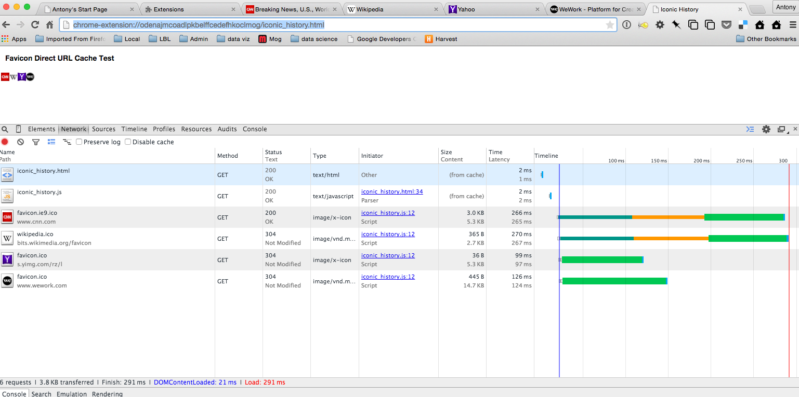
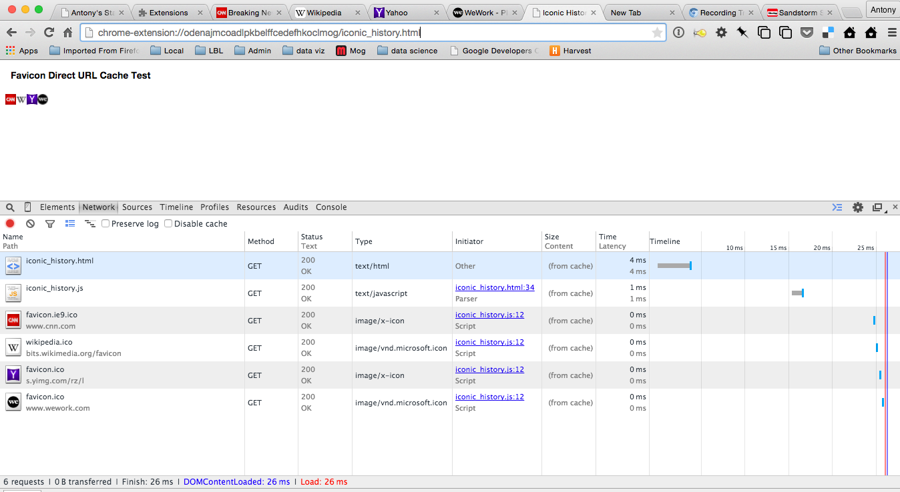

### FavIconDirectTest Chrome Extension

This is a minimal Chrome Extension to demonstrate a performance issue with how Chrome handles http requests from Chrome extensions.  *It appears that network resources loaded by popups displayed in Chrome extensions are not handled from the browser's http cache.*

**What I Expect To Happen:** I would expect all accesses to URLs from within a Chrome Extension to be fulfilled from Chrome's http cache whenever possible.

**What Actually Happens:** Looking at the Network timeline, it appears that requests to load remote URLs bypass the browser cache, always resulting in a network request (with predictably adverse effects on performance).

## To Install and Reproduce The Issue

1. Clone or unzip this repository and load it as an unpacked extension (in `chrome://extensions`).

2. Find the Extension's ID in its entry on `chrome://extensions` (a long string like `'odenajmcoadlpkbelffcedefhkoclmog'`).

3. Construct the URL to open the extension's `iconic_history.html` page using the ID, and open this in a new tab.  For example:  `'chrome-extension://odenajmcoadlpkbelffcedefhkoclmog/iconic_history.html'`.

4. Open Developer Tools, select 'Network', and Reload the page.  You should see something like this:

Note in the timeline that the last four requests (for the favicon URLs) result in network roundtrips.  This happens even after hitting reload on the page (when I would expect the relevant items to be cached).
This behavior is consistent across repeated reloads of the page.

### Update: Unexpected behavior of 'Reload' and Caching under DevTools:

Since the page exhibiting the bad caching behavior is small and isolated I decided to try and confirm that this issue only affects Chrome Extensions. I attempted to load the test page 
`iconic_history.html` both directly via a 'file://' URL and via a simple http server running locally and see if it exhibited different behavior.  To my great surprise I witnessed the same behavior when pressing 'Reload' in these cases as I did with the Chrome Extension: The image resources always resulted in network requests when pressing Reload, even though the 'Disable Cache' option in DevTools is not checked.  **As far as I can determine, the 'Reload' button always bypasses the browser's http cache and the 'Disable Cache' checkbox on the 'Network' timeline tab in DevTools is a NOP.**

If instead of hitting 'Reload' on the Extension page, one simply presses the `Enter` key in the Omnibox for the above page without modifying the URL, the result is a reload of the page that does use the Browser's http cache:

Note the '(from cache)' in the Size column, 0 ms load time for each image, and an overall load time for the page of 26 ms (compared to 291 ms in previous screenshot).

### Observations

Here are my observations thus far:

1. The real issue that prompted this investigation is a delay of several seconds for my popup to appear after clicking on the icon for my extension. There does not seem to be a way to see a timeline view for this exact period, so I'm opening the popup page in a browser tab as the best available proxy for the performance issue.

2. The 'Reload' button appears to always bypass the browser's http cache.  This is not what I would expect to happen.

3. The 'Disable Cache' checkbox on the Network pane in DevTools appears to be a NOP. Again, this is not what I would expect.

4. The observed time to load and render the popup in my original Chrome Extension is *suspiciously consistent* with the time it takes to render the page when hitting 'Reload' in a browser tab. This leads me to  *strongly suspect* that resource requests by popups in Chrome Extensions are not hitting the browser's http cache.  But I can not conclusively prove this is the case because of (1) above.

Hopefully this minimal example, the above observations, and the traces I've provided in the [open issue](https://code.google.com/p/chromium/issues/detail?id=482125) will be sufficient to investigate and resolve the issues outlined here.